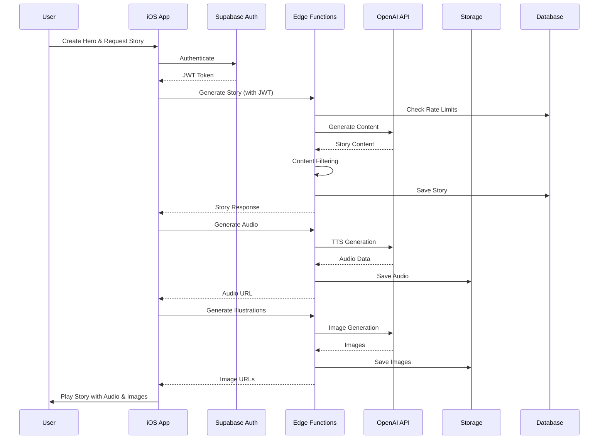

# InfiniteStories System Architecture

## Executive Summary

InfiniteStories is a sophisticated AI-powered bedtime story generation system designed for children aged 3-10. The system leverages cutting-edge AI technology to create personalized, safe, and engaging stories with professional narration and visual illustrations. Built with a modern microservices architecture, the system prioritizes child safety, scalability, and performance.

## Table of Contents

1. [System Overview](#system-overview)
2. [Architecture Principles](#architecture-principles)
3. [High-Level Architecture](#high-level-architecture)
4. [Component Architecture](#component-architecture)
5. [Data Architecture](#data-architecture)
6. [Integration Architecture](#integration-architecture)
7. [Security Architecture](#security-architecture)
8. [Performance Architecture](#performance-architecture)
9. [Deployment Architecture](#deployment-architecture)
10. [Technology Stack](#technology-stack)

## System Overview

### Vision
Create magical, personalized bedtime stories that adapt to each child's unique hero character, ensuring safe, educational, and entertaining content that grows with the child.

### Core Capabilities
- **AI Story Generation**: Leveraging GPT-5 Mini for intelligent, contextual story creation with configurable reasoning (https://context7.com/websites/platform_openai/llms.txt?topic=gpt-5-mini)
- **Professional Narration**: Enhanced quality text-to-speech with gpt-4o-mini-tts and multiple voice options (https://context7.com/websites/platform_openai/llms.txt?topic=gpt-4o-mini-tts)
- **Visual Storytelling**: AI-generated illustrations using GPT-5 with improved instruction following, synchronized with story narration (https://context7.com/websites/platform_openai/llms.txt?topic=gpt-5)
- **Content Safety**: Multi-layered content filtering ensuring child-appropriate material
- **Personalization**: Custom heroes, events, and story parameters
- **Cross-Platform Sync**: CloudKit integration for seamless experience across devices

### System Components
```
┌─────────────────────────────────────────────────────────────┐
│                      Client Layer                           │
├──────────────────────┬──────────────────────────────────────┤
│     iOS App (Swift)  │        Future: Web App               │
└──────────────────────┴──────────────────────────────────────┘
                       │
                       ▼
┌─────────────────────────────────────────────────────────────┐
│                    API Gateway Layer                        │
├─────────────────────────────────────────────────────────────┤
│              Supabase Edge Functions (Deno)                 │
└─────────────────────────────────────────────────────────────┘
                       │
        ┌──────────────┼──────────────┬──────────────┐
        ▼              ▼              ▼              ▼
┌──────────────┐ ┌──────────┐ ┌──────────┐ ┌──────────────┐
│    Story     │ │   Audio  │ │  Avatar  │ │    Scene     │
│  Generation  │ │ Synthesis│ │Generation│ │ Illustration │
└──────────────┘ └──────────┘ └──────────┘ └──────────────┘
        │              │              │              │
        └──────────────┴──────────────┴──────────────┘
                       ▼
┌─────────────────────────────────────────────────────────────┐
│                    External Services                        │
├──────────────────────┬──────────────────────────────────────┤
│     OpenAI API       │        Future: Other AI APIs         │
└──────────────────────┴──────────────────────────────────────┘
                       │
                       ▼
┌─────────────────────────────────────────────────────────────┐
│                    Data Persistence Layer                   │
├──────────────────────┬──────────────────────────────────────┤
│   PostgreSQL (RLS)   │      Supabase Storage                │
└──────────────────────┴──────────────────────────────────────┘
```

## Architecture Principles

### 1. Child Safety First
- Every design decision prioritizes child safety and age-appropriate content
- Multiple layers of content filtering and validation
- Parental controls and transparency

### 2. Scalability by Design
- Stateless microservices enable horizontal scaling
- Database connection pooling and query optimization
- CDN integration for static assets

### 3. Performance Optimization
- Edge function deployment for low latency
- Intelligent caching strategies
- Async processing for heavy operations

### 4. Security in Depth
- Zero-trust security model
- End-to-end encryption for sensitive data
- Row-level security (RLS) for data isolation

### 5. Developer Experience
- Clean separation of concerns
- Comprehensive documentation
- Automated testing and deployment

### 6. User Experience Excellence
- Offline-first mobile architecture
- Progressive enhancement
- Accessibility as a core feature

## High-Level Architecture

### System Flow



### Architectural Patterns

#### 1. Microservices Architecture
- **Story Generation Service**: Handles story creation and scene extraction
- **Audio Synthesis Service**: Manages text-to-speech conversion
- **Avatar Generation Service**: Creates consistent hero avatars
- **Scene Illustration Service**: Generates story scene images

#### 2. Event-Driven Architecture
- Asynchronous processing for long-running tasks
- Event sourcing for audit trails
- CQRS pattern for read/write optimization

#### 3. Repository Pattern
- Data access abstraction
- Testable business logic
- Database-agnostic design

#### 4. Factory Pattern
- Dynamic story event creation
- Voice configuration management
- Content filter strategy selection

## Component Architecture

### iOS Application Architecture

#### MVVM Pattern Implementation
```swift
// Model Layer - SwiftData Entities
@Model final class Hero {
    var id: UUID
    var name: String
    var traits: [CharacterTrait]
    var visualProfile: HeroVisualProfile?
    @Relationship var stories: [Story]
}

// ViewModel Layer - Business Logic
@MainActor
class StoryViewModel: ObservableObject {
    @Published var currentStory: Story?
    @Published var isGenerating: Bool = false

    private let storyService: StoryServiceProtocol
    private let audioService: AudioServiceProtocol

    func generateStory(for hero: Hero, event: StoryEvent) async
}

// View Layer - SwiftUI
struct StoryGenerationView: View {
    @StateObject private var viewModel: StoryViewModel
    var body: some View { /* UI Implementation */ }
}
```

#### Service Layer Architecture
- **AIService**: Interfaces with backend API
- **AudioService**: Manages audio playback and caching
- **StorageService**: Handles local data persistence
- **SyncService**: CloudKit synchronization
- **SecurityService**: Keychain and encryption

### Backend Architecture (Supabase Edge Functions)

#### Function Structure
```typescript
// Edge Function Template
import { serve } from 'https://deno.land/std@0.168.0/http/server.ts'
import { withEdgeFunctionWrapper } from '../_shared/index.ts'

serve(async (req) => {
  return withEdgeFunctionWrapper(req, 'function-name', async (context) => {
    // Authentication validated
    // Rate limiting checked
    // Request logged

    const result = await processRequest(context)

    // Response logged
    // Metrics recorded
    return result
  })
})
```

#### Shared Utilities Architecture
- **Authentication Middleware**: JWT validation and user context
- **Rate Limiter**: Token bucket algorithm implementation
- **Content Filter**: Multi-strategy filtering system
- **Cache Manager**: Redis-like caching with TTL
- **Logger**: Structured logging with categories
- **Error Handler**: Standardized error responses

### AI Integration Architecture

#### GPT-5 Mini Configuration
```typescript
interface GPT5MiniConfig {
  model: 'gpt-5-mini'
  reasoning_effort: 'low' | 'medium' | 'high'
  text_verbosity: 'low' | 'medium' | 'high'
  temperature: number
  max_tokens: number
}

// Optimized configurations per use case
const configs = {
  storyGeneration: {
    reasoning_effort: 'medium',
    text_verbosity: 'high',
    temperature: 0.7,
    max_tokens: 3000
  },
  sceneExtraction: {
    reasoning_effort: 'high',
    text_verbosity: 'medium',
    temperature: 0.5,
    max_tokens: 2000
  },
  contentFiltering: {
    reasoning_effort: 'low',
    text_verbosity: 'low',
    temperature: 0.3,
    max_tokens: 100
  }
}
```

#### Voice Configuration System
```typescript
interface VoiceProfile {
  id: string
  name: string
  characteristics: string[]
  instructions: string
  bestFor: StoryType[]
}

const voiceProfiles: Map<string, VoiceProfile> = new Map([
  ['coral', {
    id: 'coral',
    name: 'Coral',
    characteristics: ['warm', 'gentle', 'nurturing'],
    instructions: 'Speak like a loving grandmother telling a bedtime story...',
    bestFor: ['bedtime', 'calming']
  }]
  // Additional voice profiles...
])
```

## Data Architecture

### Database Schema

#### Core Entities
```sql
-- Users (managed by Supabase Auth)
-- Extends auth.users with profile data

-- Heroes Table
CREATE TABLE heroes (
    id UUID PRIMARY KEY DEFAULT gen_random_uuid(),
    user_id UUID REFERENCES auth.users(id),
    name TEXT NOT NULL,
    primary_trait TEXT NOT NULL,
    secondary_trait TEXT NOT NULL,
    appearance TEXT,
    special_ability TEXT,
    visual_profile JSONB,
    created_at TIMESTAMPTZ DEFAULT NOW(),
    updated_at TIMESTAMPTZ DEFAULT NOW()
);

-- Stories Table
CREATE TABLE stories (
    id UUID PRIMARY KEY DEFAULT gen_random_uuid(),
    user_id UUID REFERENCES auth.users(id),
    hero_id UUID REFERENCES heroes(id),
    title TEXT NOT NULL,
    content TEXT NOT NULL,
    event_type TEXT NOT NULL,
    scenes JSONB[],
    audio_url TEXT,
    estimated_duration INTEGER,
    play_count INTEGER DEFAULT 0,
    is_favorite BOOLEAN DEFAULT FALSE,
    created_at TIMESTAMPTZ DEFAULT NOW()
);

-- Custom Events Table
CREATE TABLE custom_events (
    id UUID PRIMARY KEY DEFAULT gen_random_uuid(),
    user_id UUID REFERENCES auth.users(id),
    title TEXT NOT NULL,
    description TEXT,
    pictogram_url TEXT,
    category TEXT,
    age_range INT4RANGE,
    keywords TEXT[],
    created_at TIMESTAMPTZ DEFAULT NOW()
);

-- API Usage Tracking
CREATE TABLE api_usage (
    id UUID PRIMARY KEY DEFAULT gen_random_uuid(),
    user_id UUID REFERENCES auth.users(id),
    function_name TEXT NOT NULL,
    request_id UUID,
    tokens_used INTEGER,
    cost_estimate DECIMAL(10,6),
    response_time_ms INTEGER,
    status TEXT,
    created_at TIMESTAMPTZ DEFAULT NOW()
);

-- Rate Limiting
CREATE TABLE rate_limits (
    id UUID PRIMARY KEY DEFAULT gen_random_uuid(),
    user_id UUID REFERENCES auth.users(id),
    function_name TEXT NOT NULL,
    request_count INTEGER DEFAULT 1,
    window_start TIMESTAMPTZ DEFAULT NOW(),
    UNIQUE(user_id, function_name, window_start)
);
```

### Storage Architecture

#### Bucket Structure
```
supabase-storage/
├── hero-avatars/       # Hero avatar images
│   └── {user_id}/
│       └── {hero_id}.png
├── story-audio/        # Generated audio files
│   └── {user_id}/
│       └── {story_id}.mp3
├── story-illustrations/ # Scene illustrations
│   └── {user_id}/
│       └── {story_id}/
│           └── scene_{n}.png
└── event-pictograms/   # Custom event icons
    └── {user_id}/
        └── {event_id}.png
```

### Caching Strategy

#### Multi-Level Caching
1. **Client-Side Cache** (iOS)
   - SwiftData local persistence
   - Audio file caching in Documents
   - Image caching with NSCache

2. **Edge Function Cache** (Backend)
   - Database-backed cache table
   - TTL-based expiration
   - Cache warming for popular content

3. **CDN Cache** (Static Assets)
   - CloudFlare/Fastly integration
   - Geographic distribution
   - Automatic cache invalidation

### Data Flow Patterns

#### Write Path
```
User Input → Validation → Business Logic → Database Write → Cache Invalidation → Event Publishing
```

#### Read Path
```
Request → Cache Check → Database Query (if miss) → Response Transform → Cache Update → Response
```

## Integration Architecture

### iOS to Backend Communication

#### API Client Architecture
```swift
protocol BackendServiceProtocol {
    func generateStory(request: StoryRequest) async throws -> StoryResponse
    func synthesizeAudio(request: AudioRequest) async throws -> AudioResponse
    func generateAvatar(request: AvatarRequest) async throws -> AvatarResponse
    func generateScenes(request: SceneRequest) async throws -> SceneResponse
}

class SupabaseBackendService: BackendServiceProtocol {
    private let client: SupabaseClient
    private let session: URLSession

    private func makeAuthenticatedRequest<T: Decodable>(
        endpoint: String,
        method: HTTPMethod,
        body: Encodable? = nil
    ) async throws -> T {
        // JWT token management
        // Request construction
        // Error handling
        // Response parsing
    }
}
```

#### Error Handling Strategy
```swift
enum BackendError: LocalizedError {
    case unauthorized
    case rateLimited(retryAfter: TimeInterval)
    case contentPolicyViolation(message: String)
    case networkError(underlying: Error)
    case serverError(code: String, message: String)

    var errorDescription: String? {
        switch self {
        case .unauthorized:
            return "Please sign in to continue"
        case .rateLimited(let retryAfter):
            return "Too many requests. Try again in \(Int(retryAfter)) seconds"
        case .contentPolicyViolation(let message):
            return "Content safety issue: \(message)"
        case .networkError(let error):
            return "Network error: \(error.localizedDescription)"
        case .serverError(_, let message):
            return message
        }
    }
}
```

### External Service Integration

#### OpenAI Integration
- **Models Used**:
  - gpt-5-mini: Story generation with configurable reasoning
  - gpt-4o-mini-tts: Enhanced quality text-to-speech synthesis
  - gpt-5: Avatar and scene generation with improved instruction following

#### Integration Patterns
```typescript
class OpenAIService {
  private async makeRequest(config: RequestConfig): Promise<Response> {
    // Retry logic with exponential backoff
    // Rate limit handling
    // Error transformation
    // Response validation
  }

  async generateStory(params: StoryParams): Promise<StoryContent> {
    // Prompt construction
    // Token optimization
    // Content extraction
    // Safety validation
  }
}
```

## Security Architecture

### Authentication & Authorization

#### Multi-Layer Security
1. **Device Level** (iOS)
   - Biometric authentication
   - Keychain storage for sensitive data
   - Certificate pinning

2. **Application Level**
   - JWT token validation
   - Session management
   - Refresh token rotation

3. **API Level**
   - Row-level security (RLS)
   - Function-level permissions
   - Request signing

### Content Safety System

#### Comprehensive Filtering Pipeline
```
Input → Profanity Filter → Context Analysis → AI Safety Check → Age Appropriateness → Output
         ↓ (fail)           ↓ (fail)          ↓ (fail)          ↓ (fail)
         Sanitize           Reject            Modify            Reject
```

#### Safety Components
1. **Rule-Based Filtering**
   - Blocked word/phrase list
   - Pattern matching for unsafe content
   - Character name validation

2. **AI-Powered Analysis**
   - gpt-5-mini content review
   - Sentiment analysis
   - Context understanding

3. **Image Safety**
   - Prompt sanitization
   - Visual content review
   - Child companion enforcement

### Data Protection

#### Encryption Strategy
- **At Rest**: AES-256 encryption for database
- **In Transit**: TLS 1.3 for all communications
- **Application**: Keychain for API keys and tokens

#### Privacy Compliance
- COPPA compliance for children's data
- GDPR compliance for EU users
- Transparent data usage policies
- Parental control features

## Performance Architecture

### Optimization Strategies

#### Frontend Optimization (iOS)
1. **Lazy Loading**
   - Paginated story library
   - On-demand audio download
   - Progressive image loading

2. **Caching**
   - SwiftData persistence
   - Audio file caching
   - Image memory cache

3. **UI Performance**
   - Async/await for non-blocking operations
   - Combine for reactive updates
   - Adaptive animations based on device

#### Backend Optimization (Edge Functions)
1. **Query Optimization**
   - Indexed database queries
   - Batch operations
   - Connection pooling

2. **Caching Strategy**
   - Content-based cache keys
   - Intelligent TTL management
   - Cache warming

3. **Resource Management**
   - Function concurrency limits
   - Memory optimization
   - Cold start mitigation

### Scalability Patterns

#### Horizontal Scaling
```
Load Balancer
     ↓
┌────────┬────────┬────────┐
│ Edge 1 │ Edge 2 │ Edge 3 │  (Stateless Functions)
└────────┴────────┴────────┘
     ↓         ↓         ↓
┌─────────────────────────┐
│   Shared Database Pool  │   (Connection Pooling)
└─────────────────────────┘
```

#### Performance Metrics
- **Target Response Times**:
  - Story Generation: < 3 seconds
  - Audio Generation: < 5 seconds
  - Image Generation: < 8 seconds
  - API Gateway: < 100ms overhead

## Deployment Architecture

### Environment Strategy

#### Development Pipeline
```
Local Dev → Feature Branch → Staging → Production
    ↓           ↓               ↓          ↓
  Supabase   GitHub PR      Preview     Main
   Local      Review         Deploy    Deploy
```

#### Environment Configuration
| Environment | Database | Edge Functions | Storage | Auth |
|------------|----------|---------------|---------|------|
| Development | Local PG | Local Deno | Local | Local |
| Staging | Shared PG | Preview Deploy | Shared | Test |
| Production | Dedicated PG | Production | Production | Live |

### CI/CD Pipeline

#### Automated Workflows
1. **Code Quality**
   - Linting (SwiftLint, ESLint)
   - Type checking
   - Security scanning

2. **Testing**
   - Unit tests
   - Integration tests
   - E2E tests
   - Performance tests

3. **Deployment**
   - Database migrations
   - Function deployment
   - iOS app distribution
   - Rollback procedures

### Monitoring & Observability

#### Logging Architecture
```typescript
interface LogEntry {
  timestamp: string
  level: 'DEBUG' | 'INFO' | 'WARN' | 'ERROR'
  category: string
  message: string
  context: {
    requestId: string
    userId?: string
    functionName: string
    duration?: number
  }
  metadata?: Record<string, any>
}
```

#### Metrics Collection
- **Application Metrics**:
  - Story generation count
  - Audio playback statistics
  - User engagement metrics
  - Feature adoption rates

- **Performance Metrics**:
  - API response times
  - Database query performance
  - Cache hit rates
  - Error rates

- **Business Metrics**:
  - Daily active users
  - Stories per user
  - Voice preference distribution
  - Custom event creation

## Technology Stack

### Frontend Technologies
- **Language**: Swift 5.9+
- **UI Framework**: SwiftUI 5.0
- **Data Persistence**: SwiftData
- **Networking**: URLSession + Async/Await
- **Audio**: AVFoundation
- **State Management**: Combine + @Observable
- **Testing**: XCTest + XCUITest

### Backend Technologies
- **Runtime**: Deno 1.37+
- **Language**: TypeScript 5.0+
- **API Gateway**: Supabase Edge Functions
- **Database**: PostgreSQL 15
- **Storage**: Supabase Storage (S3-compatible)
- **Authentication**: Supabase Auth (JWT)
- **Testing**: Deno Test

### External Services
- **AI Provider**: OpenAI
  - gpt-5-mini (text generation with configurable reasoning)
  - gpt-4o-mini-tts (enhanced quality audio)
  - gpt-5 (images with improved instruction following)
- **CDN**: CloudFlare
- **Monitoring**: Supabase Analytics
- **Error Tracking**: Sentry (planned)

### Development Tools
- **Version Control**: Git + GitHub
- **CI/CD**: GitHub Actions
- **Project Management**: GitHub Projects
- **Documentation**: Markdown + Mermaid
- **API Testing**: Postman/Thunder Client
- **Database Management**: Supabase Studio

## Future Architecture Considerations

### Planned Enhancements

#### Phase 1 (Q1 2025)
- WebSocket support for real-time features
- Offline mode with sync
- Multiple language support
- Voice input for story preferences

#### Phase 2 (Q2 2025)
- Web application development
- Android application
- Parental dashboard
- Educational curriculum integration

#### Phase 3 (Q3 2025)
- Multi-user story creation
- Social sharing features
- Story templates marketplace
- Advanced analytics dashboard

### Technology Migration Path

#### Potential Upgrades
1. **GraphQL API** for more flexible queries
2. **Redis** for high-performance caching
3. **Kubernetes** for container orchestration
4. **Event streaming** with Kafka/Pulsar
5. **ML Pipeline** for personalization

### Scalability Roadmap

#### Growth Preparation
- Database sharding strategy
- Multi-region deployment
- Content delivery optimization
- Microservices decomposition
- API versioning strategy

## Conclusion

The InfiniteStories architecture represents a modern, scalable, and secure system designed to deliver magical storytelling experiences to children worldwide. By leveraging cutting-edge AI technology (GPT-5 Mini with configurable reasoning, GPT-5 with improved instruction following, and gpt-4o-mini-tts with enhanced quality), cloud-native architecture patterns, and a strong focus on safety and performance, the system provides a robust foundation for current features while maintaining flexibility for future growth and innovation.

The architecture prioritizes:
- **Child Safety**: Through comprehensive content filtering and validation
- **Performance**: Via intelligent caching and optimization strategies
- **Scalability**: Using stateless microservices and cloud-native patterns
- **Developer Experience**: With clean architecture and comprehensive documentation
- **User Experience**: Through offline support and responsive design

This living document will continue to evolve as the system grows and new requirements emerge.

---

*Document Version: 1.0.0*
*Last Updated: September 2025*
*Next Review: Q4 2025*