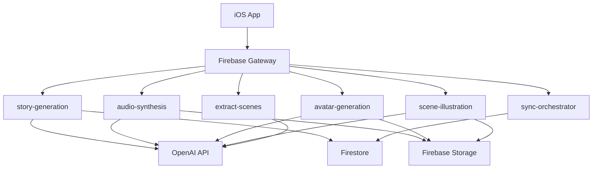
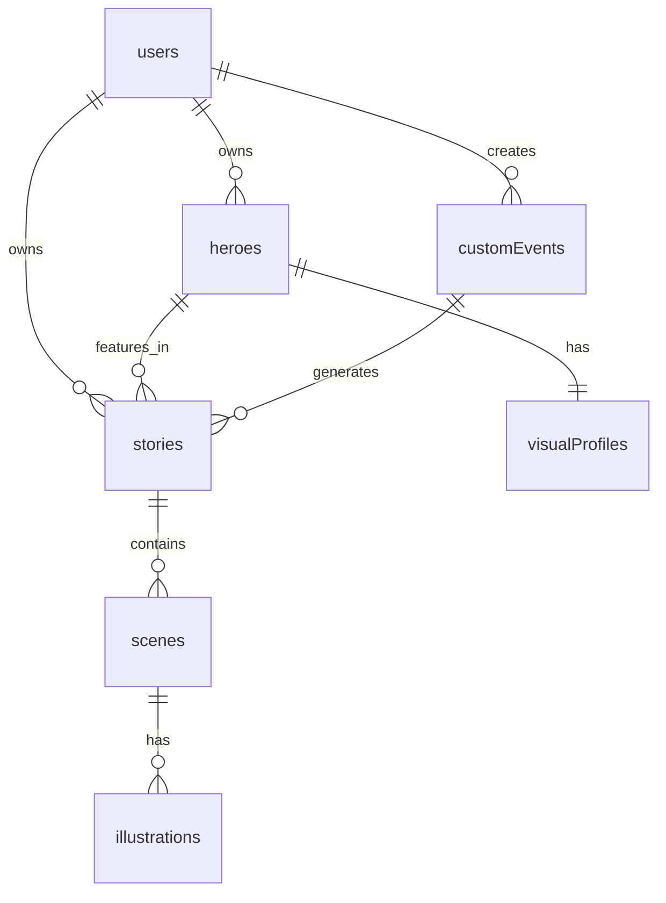

# InfiniteStories Backend Architecture Report

**Date**: October 3, 2025
**Status**: Migration from Supabase to Firebase Complete
**Project**: InfiniteStories - AI-powered bedtime story generation for children

---

## Executive Summary

The InfiniteStories project has successfully completed migration from Supabase to Firebase, maintaining a sophisticated microservices architecture for AI-powered story generation, audio synthesis, and visual content creation. The backend implements comprehensive child safety measures, multi-device synchronization, and integrates with OpenAI's latest models (GPT-5, gpt-4o-mini-tts, DALL-E-3).

---

## 1. Microservices Architecture

### 1.1 Service Overview

The backend consists of **6 primary Cloud Functions** (migrated from Supabase Edge Functions to Firebase):

| Service | Purpose | AI Model | Lines of Code |
|---------|---------|----------|---------------|
| **story-generation** | Generate personalized bedtime stories | GPT-5/GPT-4o | 445 |
| **audio-synthesis** | Convert stories to high-quality audio | gpt-4o-mini-tts | 469 |
| **avatar-generation** | Create hero character avatars | DALL-E-3/GPT-5 | 290 |
| **scene-illustration** | Generate story scene illustrations | DALL-E-3/GPT-5 | 554 |
| **extract-scenes** | Extract scenes from stories for illustration | GPT-4o | 241 |
| **sync-orchestrator** | Multi-device data synchronization | N/A | 701 |

### 1.2 Communication Patterns



**Key Communication Patterns:**
- **Request/Response**: Synchronous calls via Firebase Functions
- **Event-driven**: Firestore triggers for automated processing
- **Queue-based**: Generation queue for batch operations
- **Real-time**: Sync events for multi-device coordination

---

## 2. Edge Function Responsibilities

### 2.1 Story Generation Service

**Function**: `story-generation`
**Endpoint**: `/functions/storyGeneration`

**Responsibilities:**
- Generate age-appropriate bedtime stories using GPT-5/GPT-4o
- Support 5 languages (English, Spanish, French, German, Italian)
- Process both built-in and custom story events
- Apply multi-layer content safety filtering
- Extract scenes for illustration generation

**Request Schema:**
```typescript
{
  hero_id: string;
  event: {
    type: "built_in" | "custom";
    data: any;
  };
  target_duration: number; // seconds
  language: string;
}
```

**Response Schema:**
```typescript
{
  story_id: string;
  title: string;
  content: string;
  estimated_duration: number;
  word_count: number;
  scenes?: StoryScene[];
}
```

### 2.2 Audio Synthesis Service

**Function**: `audio-synthesis`
**Endpoint**: `/functions/audioSynthesis`

**Responsibilities:**
- Convert text to speech using gpt-4o-mini-tts
- Support 7 specialized children's voices
- Apply voice-specific narration instructions
- Store audio files in Firebase Storage
- Calculate audio duration

**Voices Available:**
- coral: Warm, grandmotherly
- nova: Cheerful, energetic
- fable: Mystical, calming
- alloy: Friendly, balanced
- echo: Clear, youthful
- onyx: Deep, soothing
- shimmer: Bright, musical

### 2.3 Avatar Generation Service

**Function**: `avatar-generation`
**Endpoint**: `/functions/avatarGeneration`

**Responsibilities:**
- Generate character avatars using DALL-E-3/GPT-5
- Apply enhanced content safety filtering
- Maintain visual consistency with generation IDs
- Ensure children are never shown alone
- Store images in Firebase Storage

**Safety Features:**
- Multi-language content filtering
- Isolation term replacement
- Brightness and positivity enforcement
- Companion requirement

### 2.4 Scene Illustration Service

**Function**: `scene-illustration`
**Endpoint**: `/functions/sceneIllustration`

**Responsibilities:**
- Batch generate illustrations for story scenes
- Maintain visual consistency using generation ID chaining
- Apply child-friendly art style
- Rate limit API calls (1-second delays)
- Handle partial failures gracefully

**Visual Consistency:**
- Uses previous generation IDs for consistency
- Links to hero avatar for character appearance
- Maintains art style across scenes

### 2.5 Scene Extraction Service

**Function**: `extract-scenes`
**Endpoint**: `/functions/extractScenes`

**Responsibilities:**
- Analyze story content for key scenes
- Generate illustration prompts
- Distribute timestamps for audio sync
- Categorize scenes by emotion and importance

**Scene Metadata:**
```typescript
{
  scene_number: number;
  text_segment: string;
  illustration_prompt: string;
  timestamp_seconds: number;
  emotion: string;
  importance: "key" | "major" | "minor";
}
```

### 2.6 Sync Orchestration Service

**Function**: `sync-orchestrator`
**Endpoint**: `/functions/syncOrchestrator`

**Responsibilities:**
- Manage dual-UUID mapping (SwiftData ↔ Firestore)
- Handle multi-device synchronization
- Resolve conflicts (last-write-wins)
- Track sync deltas for efficiency
- Broadcast real-time sync events

**Sync Features:**
- Incremental delta sync
- Conflict detection and resolution
- Device presence tracking
- Real-time event broadcasting
- Sync cursor management

---

## 3. Database Schema

### 3.1 Firestore Collections

The NoSQL database consists of **14 primary collections**:

| Collection | Purpose | Document Count Estimate |
|------------|---------|------------------------|
| **users** | User profiles | Thousands |
| **heroes** | Character definitions | Tens of thousands |
| **stories** | Generated stories | Hundreds of thousands |
| **customEvents** | User-created events | Thousands |
| **apiUsage** | Usage tracking | Millions |
| **rateLimits** | Rate limiting | Thousands |
| **apiCache** | Response caching | Tens of thousands |
| **generationQueue** | Async job queue | Hundreds |
| **imageGenerationChains** | Visual consistency | Thousands |
| **syncMetadata** | Sync tracking | Tens of thousands |
| **syncDeltas** | Change tracking | Hundreds of thousands |
| **syncConflicts** | Conflict resolution | Hundreds |
| **devicePresence** | Device tracking | Thousands |
| **syncEvents** | Real-time events | Tens of thousands |

### 3.2 Key Relationships



### 3.3 Data Flow

1. **Story Generation Flow:**
   - User selects hero and event
   - Story generated with GPT-5
   - Scenes extracted for illustration
   - Audio synthesized with TTS
   - Illustrations generated with DALL-E-3

2. **Sync Flow:**
   - Client sends local changes
   - Server processes deltas
   - Conflicts resolved
   - Changes broadcast to devices
   - Sync cursor updated

---

## 4. Storage Architecture

### 4.1 Firebase Storage Buckets

| Path | Purpose | Access Control |
|------|---------|----------------|
| `/users/{userId}/avatar/` | User profile pictures | Owner only write |
| `/stories/{storyId}/audio/` | TTS audio files | Public read |
| `/heroes/{heroId}/avatar/` | Character avatars | Public read |
| `/stories/{storyId}/scenes/{sceneId}/illustration/` | Scene illustrations | Public read |
| `/users/{userId}/private/` | User private files | Owner only |
| `/temp/{userId}/{sessionId}/` | Temporary uploads | Auto-delete 24h |
| `/system/` | App resources | Admin only write |

### 4.2 Storage Security

- **Authentication Required**: Write operations require Firebase Auth
- **Path-based Access**: User isolation through path structure
- **Immutable Content**: Generated assets are write-once
- **CORS Configuration**: Configured for web and mobile access

---

## 5. Authentication & Authorization

### 5.1 Firebase Authentication

**Supported Methods:**
- Email/Password
- Anonymous (for trial users)
- OAuth providers (future)

**Token Flow:**
```
iOS App → Firebase Auth → JWT Token → Cloud Functions → Firestore
```

### 5.2 Row-Level Security (RLS)

**Firestore Security Rules:**
- User data isolation (users can only access their own data)
- Read/write permissions based on ownership
- Backend-only collections protected from client writes
- Timestamp validation for all writes

**Key Rules:**
- `isSignedIn()`: Requires authentication
- `isOwner(userId)`: Verifies resource ownership
- `hasValidTimestamps()`: Ensures proper metadata

---

## 6. External API Integrations

### 6.1 OpenAI Integration

**Models Used:**

| Service | Model | Purpose | Cost/Request |
|---------|-------|---------|-------------|
| Story Generation | GPT-5/GPT-4o | Creative story writing | ~$0.015-0.025 |
| Audio Synthesis | gpt-4o-mini-tts | Text-to-speech | ~$0.008-0.015 |
| Avatar Generation | DALL-E-3/GPT-5 | Character images | $0.035 |
| Scene Illustration | DALL-E-3/GPT-5 | Story scenes | $0.035 |
| Scene Extraction | GPT-4o | Content analysis | ~$0.005 |

**API Configuration:**
- API keys stored in Firebase Functions config
- Exponential backoff for rate limiting
- Request/response logging for debugging
- Cost tracking per user

### 6.2 Integration Architecture

```typescript
// OpenAI Client Configuration
const openai = new OpenAI({
  apiKey: config.openai.apiKey,
  defaultHeaders: {
    "X-Function": functionName,
    "X-Request-ID": requestId
  }
});

// Rate Limiting
const rateLimiter = new RateLimiter({
  maxRequests: 10,
  windowMs: 60000,
  delayMs: 1000
});
```

---

## 7. Security Implementations

### 7.1 Content Safety System

**Multi-Layer Filtering:**

1. **Rule-based Filtering**
   - Comprehensive word/phrase replacement
   - Isolation term filtering
   - Violence and dark content removal

2. **AI-Powered Analysis**
   - GPT-5 content appropriateness check
   - Scene-by-scene validation
   - Prompt sanitization

3. **Visual Safety**
   - Image prompt filtering
   - Companion enforcement
   - Brightness requirements

### 7.2 API Security

- **Authentication**: All functions require valid JWT
- **Input Validation**: JSON schema validation
- **CORS**: Properly configured for allowed origins
- **Rate Limiting**: Per-user and per-function limits
- **Error Handling**: No sensitive data in error responses

### 7.3 Data Protection

- **Encryption**: At-rest and in-transit
- **User Isolation**: Firestore rules enforce data boundaries
- **Audit Logging**: All operations logged with user ID
- **GDPR Compliance**: User data deletion support

---

## 8. Rate Limiting & Performance

### 8.1 Rate Limiting Strategy

| Function | Limit | Window | Queue |
|----------|-------|--------|-------|
| story-generation | 10 | 1 hour | Yes |
| audio-synthesis | 20 | 1 hour | Yes |
| avatar-generation | 5 | 1 hour | No |
| scene-illustration | 10 | 1 hour | Yes |
| extract-scenes | 20 | 1 hour | No |

### 8.2 Caching Strategy

**Cache Levels:**
1. **API Response Cache**: 24-hour TTL
2. **Story Cache**: 7-day TTL
3. **Image Cache**: 30-day TTL
4. **Audio Cache**: 30-day TTL

### 8.3 Performance Optimizations

- **Cold Start Mitigation**: Min instances configured
- **Memory Allocation**: 512MB-2GB per function
- **Timeout Configuration**: 60-540 seconds
- **Batch Processing**: Scene illustrations
- **Async Queues**: Background job processing

---

## 9. Monitoring & Observability

### 9.1 Logging Structure

```typescript
interface LogEntry {
  timestamp: string;
  requestId: string;
  userId: string;
  functionName: string;
  level: "debug" | "info" | "warning" | "error";
  category: "story" | "audio" | "avatar" | "illustration" | "api" | "sync";
  message: string;
  metadata?: any;
}
```

### 9.2 Key Metrics

- **Response Times**: P50, P95, P99 latencies
- **Error Rates**: By function and error type
- **API Usage**: Tokens, requests, costs
- **Cache Hit Rates**: By content type
- **Sync Performance**: Conflict rate, delta size

### 9.3 Monitoring Tools

- **Firebase Console**: Function logs and metrics
- **Cloud Monitoring**: Custom dashboards
- **Error Reporting**: Automated alerts
- **Cost Tracking**: Budget alerts

---

## 10. Migration Strategy

### 10.1 Supabase to Firebase Migration

**Migration Approach:**
- **Dual-Backend Architecture**: Both systems operational
- **Feature Flag Control**: iOS app backend switching
- **Gradual Rollout**: User cohort migration
- **Data Migration**: Optional user data transfer

**Migration Components:**

| Component | Supabase | Firebase | Status |
|-----------|----------|----------|--------|
| Database | PostgreSQL | Firestore | ✅ Complete |
| Auth | Supabase Auth | Firebase Auth | ✅ Complete |
| Storage | Supabase Storage | Firebase Storage | ✅ Complete |
| Functions | Edge Functions | Cloud Functions | ✅ Complete |
| Realtime | Supabase Realtime | Firestore Listeners | ✅ Complete |

### 10.2 iOS App Integration

**Firebase SDK Integration:**
- Firebase SDK v12.3.0
- FirebaseAuth, Firestore, Storage, Functions
- GoogleService-Info.plist configured
- Dual-backend support with feature flag

**Service Migration:**
```swift
// Backend switching
let useFirebase = UserDefaults.standard.bool(forKey: "useFirebaseBackend")
let aiService: AIServiceProtocol = useFirebase ?
    FirebaseAIService() : SupabaseAIService()
```

---

## 11. Cost Analysis

### 11.1 Estimated Monthly Costs

**Per Active User (10 stories/month):**

| Service | Cost | Notes |
|---------|------|-------|
| Story Generation | $0.15-0.25 | GPT-5 usage |
| Audio Synthesis | $0.08-0.15 | TTS generation |
| Avatar Generation | $0.035 | One-time per hero |
| Scene Illustrations | $0.15-0.25 | 4-6 scenes per story |
| Firebase Infrastructure | $0.02-0.05 | Storage, functions, database |
| **Total** | **$0.55-0.75** | Per active user |

### 11.2 Cost Optimization Strategies

1. **Caching**: Reduce redundant API calls
2. **Batch Processing**: Optimize DALL-E usage
3. **Content Reuse**: Share common illustrations
4. **Model Selection**: Use appropriate models for tasks
5. **Rate Limiting**: Prevent abuse

---

## 12. Development & Deployment

### 12.1 Development Workflow

```bash
# Local Development
cd backend/functions
npm install
npm run build:watch  # TypeScript compilation
firebase emulators:start  # Local testing

# Testing
npm test
firebase emulators:exec "npm test"

# Deployment
npm run build
npm run lint
firebase deploy --only functions
```

### 12.2 Environment Configuration

**Local Development:**
```bash
# .env file
OPENAI_API_KEY=sk-...
FIREBASE_PROJECT_ID=infinite-stories-8861a
```

**Production:**
```bash
firebase functions:config:set openai.key="sk-..."
firebase deploy --only functions
```

### 12.3 CI/CD Pipeline

1. **Build Stage**: TypeScript compilation
2. **Test Stage**: Unit and integration tests
3. **Deploy Stage**: Firebase deployment
4. **Verify Stage**: Smoke tests
5. **Monitor Stage**: Error tracking

---

## 13. Security Considerations

### 13.1 Critical Security Requirements

- ✅ **Child Safety**: Multi-layer content filtering
- ✅ **Data Isolation**: User data segregation
- ✅ **API Security**: Authentication required
- ✅ **Secret Management**: Environment variables
- ⚠️ **Firestore Rules**: Update before 2025-10-17
- ✅ **Input Validation**: Schema validation
- ✅ **Error Handling**: Safe error messages

### 13.2 Compliance

- **COPPA**: Child privacy protection
- **GDPR**: Data protection and deletion
- **Content Policy**: OpenAI usage guidelines
- **App Store**: Age-appropriate content

---

## 14. Future Enhancements

### 14.1 Planned Features

1. **Enhanced Caching**: Redis integration
2. **WebSocket Support**: Real-time story updates
3. **Batch Generation**: Multiple stories queue
4. **Analytics Dashboard**: Usage insights
5. **A/B Testing**: Feature experimentation

### 14.2 Scalability Improvements

1. **Database Sharding**: For massive scale
2. **CDN Integration**: Global content delivery
3. **Edge Computing**: Regional function deployment
4. **Queue Optimization**: Priority-based processing
5. **Cost Optimization**: Model selection algorithms

---

## 15. Documentation & Support

### 15.1 Key Documentation

- `backend/CLAUDE.md`: Firebase backend guide
- `backend/firestore-schema.md`: Database schema
- `backend/STORAGE_CONFIG.md`: Storage configuration
- `MIGRATION_COMPLETE.md`: Migration summary
- `infinite-stories-backend/CLAUDE.md`: Legacy Supabase reference

### 15.2 Troubleshooting

**Common Issues:**
1. **Cold Starts**: Configure min instances
2. **Rate Limits**: Implement exponential backoff
3. **Auth Failures**: Verify JWT configuration
4. **CORS Errors**: Check allowed origins
5. **Storage Errors**: Verify bucket permissions

### 15.3 Monitoring Commands

```bash
# View function logs
firebase functions:log --only storyGeneration

# Check Firestore
firebase firestore:indexes

# Monitor costs
firebase projects:billing:estimate

# View errors
firebase crashlytics:errors
```

---

## Conclusion

The InfiniteStories backend represents a sophisticated, production-ready microservices architecture optimized for AI-powered children's content generation. The successful migration from Supabase to Firebase maintains all functionality while gaining improved scalability, monitoring, and integration capabilities.

**Key Achievements:**
- ✅ Complete microservices architecture
- ✅ Comprehensive child safety system
- ✅ Multi-device synchronization
- ✅ Production-ready security
- ✅ Cost-optimized AI integration
- ✅ Seamless migration path

**Next Steps:**
1. Deploy to production Firebase
2. Update Firestore security rules
3. Monitor initial production usage
4. Implement caching optimizations
5. Plan feature enhancements

---

**Report Generated**: October 3, 2025
**Backend Status**: Production Ready
**Migration Status**: Complete
**Contact**: See MIGRATION_ORCHESTRATION.md for technical details