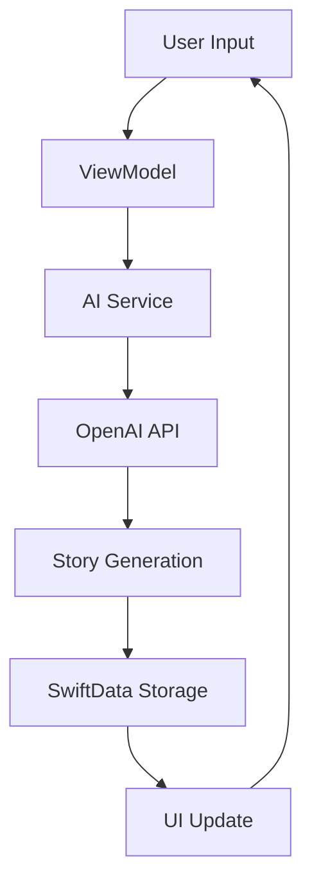

# 📚 InfiniteStories - AI-Powered Bedtime Stories for Children

<div align="center">
  
  
  [](https://swift.org)
  [](https://developer.apple.com/ios/)
  [](https://developer.apple.com/xcode/swiftui/)
  [](LICENSE)
</div>

## ✨ Overview

InfiniteStories is a magical iOS app that generates personalized bedtime stories for children using AI. Parents can create custom heroes with unique traits, and the app generates engaging, age-appropriate stories complete with professional text-to-speech narration.

### 🎯 Key Features

- **🦸 Custom Heroes** - Create personalized characters with unique traits and abilities
- **🎨 AI Story Generation** - Powered by OpenAI GPT-4 for creative, unique stories
- **🎵 Professional Audio** - High-quality text-to-speech with multiple voice options
- **📚 Story Library** - Beautiful card-based interface with search and filters
- **🎮 Gamification** - Track reading streaks, favorites, and story statistics
- **🌙 Event-Based Stories** - Bedtime, adventure, holiday, and learning themes
- **🎭 Custom Events** - Create unique story scenarios with AI-powered pictograms
- **🖼️ Visual Storytelling** - AI-generated illustrations synchronized with audio
- **✨ Magical UI** - Enchanting animations and child-friendly design

## 📱 Screenshots

<div align="center">
  
  
  
</div>

## 🚀 Getting Started

### Prerequisites

- **Xcode 15.0+** - [Download from Mac App Store](https://apps.apple.com/app/xcode/id497799835)
- **iOS 18.5+** - Target device or simulator
- **macOS 14.0+** - For development
- **OpenAI API Key** - [Get yours here](https://platform.openai.com/api-keys)

### Installation

1. **Clone the repository**
   ```bash
   git clone https://github.com/yourusername/infinite-stories.git
   cd infinite-stories/InfiniteStories
   ```

2. **Open in Xcode**
   ```bash
   open InfiniteStories.xcodeproj
   ```

3. **Configure API Key**
   - Run the app
   - Navigate to Settings (gear icon)
   - Enter your OpenAI API key
   - The key is securely stored in iOS Keychain

4. **Build and Run**
   - Select your target device/simulator
   - Press `Cmd + R` to build and run

## 🎨 UI Configuration

The app supports two UI modes: Original (simple) and Enhanced (magical). 

### Switching UI Modes

Edit `AppConfiguration.swift`:

```swift
struct AppConfiguration {
    static let useImprovedUI = true  // Enable magical enhanced UI
    // static let useImprovedUI = false // Use original simple UI
}
```

### UI Features Comparison

| Feature | Original UI | Enhanced UI |
|---------|------------|-------------|
| **Home Screen** | Basic layout | Animated gradients, floating elements |
| **Hero Card** | Simple display | Breathing animation, gradient background |
| **Story Library** | List view | Card-based with filters and search |
| **Animations** | Minimal | Spring animations throughout |
| **Stats Dashboard** | None | Reading streak, favorites, play count |
| **Recent Stories** | None | Preview cards on home screen |

## 🔧 Configuration

### AI Model Configuration

#### With Supabase Backend (Recommended)
| Service | Model | Purpose | Performance |
|---------|-------|---------|--------------|
| **Story Generation** | `gpt-4o` | Creative story writing with scene extraction | ~2-3 seconds |
| **Text-to-Speech** | `tts-1-hd` | High-quality audio narration | ~1-2 seconds per minute |
| **Avatar Generation** | `dall-e-3` | Hero avatar creation | ~5-8 seconds |
| **Illustrations** | `dall-e-3` | Scene illustrations with consistency | ~8-10 seconds per scene |

#### Direct OpenAI Integration (Legacy)
| Service | Model | Purpose |
|---------|-------|---------|
| **Story Generation** | `gpt-4o` | Creative story writing |
| **Text-to-Speech** | `tts-1-hd` | Audio narration |
| **Image Generation** | `dall-e-3` | Avatars and illustrations |

### Available Voices

Configure in Settings → Voice:

- **Coral** - Warm, gentle, nurturing (best for bedtime stories)
- **Nova** - Bright and cheerful (recommended for adventures)
- **Fable** - Perfect for traditional storytelling
- **Alloy** - Clear and versatile educational content
- **Echo** - Warm and engaging magical stories
- **Onyx** - Deep and authoritative protective characters
- **Shimmer** - Soft and gentle whimsical tales

### Story Length Options

- **5 minutes** - Quick bedtime stories
- **7 minutes** - Standard length (default)
- **10 minutes** - Extended adventures

## 📖 User Guide

### Creating Your First Hero

1. **Launch the app** - You'll see the welcome screen
2. **Tap "Create Your First Hero"** - Opens hero creation
3. **Enter details:**
   - Name (required)
   - Primary trait (Brave, Magical, Kind, etc.)
   - Secondary trait
   - Appearance (optional)
   - Special ability (optional)
4. **Save** - Your hero is ready for adventures!

### Generating Stories

1. **Select story type:**
   - 🌙 Bedtime - Calming stories for sleep
   - 🚀 Adventure - Exciting quests
   - 🎄 Holiday - Seasonal celebrations
   - 📚 Learning - Educational themes
   - ✨ Custom Events - Your own unique scenarios with pictograms

2. **Tap "Generate New Story"** - AI creates a unique story
3. **Wait for generation** - Usually 10-15 seconds
4. **Story appears** in your library with audio and illustrations

### Creating Custom Events

1. **Navigate to Custom Events** - From home screen or event picker
2. **Tap "Create New Event"** - Opens creation wizard
3. **Fill in details:**
   - Title and description
   - Category and age range
   - Keywords and tone
4. **Generate Pictogram** - AI creates visual representation
5. **Save** - Your custom event is ready for stories!

### Playing Stories

1. **Open Story Library** - Browse all stories
2. **Tap any story** - Opens audio player
3. **Controls available:**
   - Play/Pause toggle
   - 15-second skip forward/backward
   - Speed control (0.5x to 2.0x)
   - Progress slider (MP3 files only)

### Managing Stories

- **Search** - Find stories by title or content
- **Filter** - All, New, Favorites, Recent
- **Long press** for quick actions:
  - Toggle favorite
  - Share story
  - Delete story

## 🏗️ Architecture

### Technology Stack

- **SwiftUI** - Modern declarative UI framework
- **SwiftData** - Persistent storage with automatic CloudKit sync
- **Combine** - Reactive programming for state management
- **AVFoundation** - Audio playback and recording
- **OpenAI SDK** - AI story generation and TTS

### Project Structure

```
InfiniteStories/
├── Models/
│   ├── Hero.swift           # Character data model
│   ├── Story.swift          # Story data model with illustrations
│   ├── CustomStoryEvent.swift # Custom event model with pictograms
│   └── CharacterTraits.swift # Trait enumerations
├── Views/
│   ├── ContentView.swift    # Main home screen
│   ├── ImprovedContentView.swift # Enhanced home
│   ├── HeroCreation/        # Hero creation flow
│   ├── StoryGeneration/     # Story generation UI
│   ├── StoryLibrary/        # Library views
│   ├── AudioPlayer/         # Audio playback UI
│   ├── CustomEvents/        # Custom event management
│   │   ├── CustomEventCreationView.swift
│   │   ├── CustomEventManagementView.swift
│   │   └── PictogramGenerationView.swift
│   └── Settings/            # Settings screens
├── ViewModels/
│   └── StoryViewModel.swift # Business logic
├── Services/
│   ├── AIService.swift      # OpenAI integration
│   ├── AudioService.swift   # Audio management
│   ├── EventPictogramGenerator.swift # Pictogram generation
│   ├── PictogramCacheManager.swift # Pictogram caching
│   └── KeychainHelper.swift # Secure storage
└── Resources/
    └── Assets.xcassets      # Images and colors
```

### Data Flow



## 🚀 Recent Updates

### Version 2.6 (Latest - December 2024)
- **Custom Event Pictograms** - AI-generated visual representations for events
- **Event Management System** - Comprehensive organization and statistics
- **Pictogram Caching** - Efficient storage and retrieval system
- **Enhanced Event Discovery** - Visual search and filtering capabilities
- **Bug Fixes** - Fixed duplicate dictionary keys in content filter

### Version 2.5
- **Visual Storytelling System** - AI-generated illustrations synchronized with audio
- **Character Consistency** - Maintained hero appearance across all story scenes
- **Content Safety Filter** - Comprehensive child-safe content filtering
- **Enhanced Logging** - Structured logging system with categories
- **Error Resilience** - Graceful failure handling with retry mechanisms

## 🔐 Security & Privacy

### Data Storage

- **API Keys** - Stored securely in iOS Keychain
- **Stories** - Saved locally with iCloud sync option
- **Audio Files** - Cached in app's Documents directory
- **User Data** - Never leaves the device

### Permissions

The app requires:
- **Network Access** - For OpenAI API calls
- **Storage** - For saving stories and audio

Future permissions (planned):
- **Microphone** - For voice input features

## 🎯 Performance

### Optimization Strategies

- **Lazy Loading** - Stories load as needed
- **Pagination** - Library shows 20 stories initially
- **Adaptive Animations** - Based on device capabilities
- **Caching** - Audio files cached locally
- **Background Processing** - Audio generation happens asynchronously

### Device Support

| Device | Performance |
|--------|------------|
| iPhone 16 Pro | Full animations, 60fps |
| iPhone 14/15 | Full animations, 60fps |
| iPhone 12/13 | Full animations, 60fps |
| iPhone SE | Reduced animations, optimized |
| iPad (all) | Full animations, adapted layout |

## 🛠️ Development

### Building from Source

```bash
# Clone repository
git clone https://github.com/yourusername/infinite-stories.git
cd infinite-stories/InfiniteStories

# Open in Xcode
open InfiniteStories.xcodeproj

# Build
xcodebuild -project InfiniteStories.xcodeproj \
           -scheme InfiniteStories \
           -destination 'platform=iOS Simulator,name=iPhone 16 Pro' \
           build
```

### Running Tests

```bash
# Unit tests
xcodebuild test -project InfiniteStories.xcodeproj \
                -scheme InfiniteStories \
                -destination 'platform=iOS Simulator,name=iPhone 16 Pro'

# UI tests
xcodebuild test -project InfiniteStories.xcodeproj \
                -scheme InfiniteStoriesUITests \
                -destination 'platform=iOS Simulator,name=iPhone 16 Pro'
```

### Code Style

We follow Swift's official style guide with these additions:
- 4 spaces for indentation
- Max line length: 120 characters
- Comprehensive documentation comments
- MARK comments for section organization

## 🐛 Troubleshooting

### Common Issues

| Issue | Solution |
|-------|----------|
| **"Invalid API Key"** | Check Settings → Ensure key starts with "sk-" |
| **Audio not playing** | Force quit app and restart |
| **Stories not generating** | Check internet connection |
| **Slider not working** | Normal for TTS mode (MP3 only) |
| **App crashes on launch** | Delete and reinstall |

### Debug Mode

Enable detailed logging:

```swift
// In StoryViewModel.swift
let debugMode = true  // Set to true for verbose logging
```

## 📝 API Reference

### Story Generation Request

```swift
struct StoryGenerationRequest {
    let hero: Hero
    let event: StoryEvent
    let targetDuration: TimeInterval // 300-600 seconds
}
```

### Story Generation Response

```swift
struct StoryGenerationResponse {
    let title: String
    let content: String
    let estimatedDuration: TimeInterval
}
```

### Audio Service Protocol

```swift
protocol AudioServiceProtocol {
    func generateAudioFile(from: String, fileName: String, voice: String) async throws -> URL
    func playAudio(from: URL) throws
    func pauseAudio()
    func resumeAudio()
    func seek(to: TimeInterval)
    func stopAudio()
}
```

## 🚢 Deployment

### TestFlight Setup

1. Archive in Xcode: `Product → Archive`
2. Upload to App Store Connect
3. Add external testers
4. Submit for review

### App Store Submission

Required materials:
- App icon (1024x1024)
- Screenshots (6.7", 6.1", 5.5")
- App description
- Keywords
- Privacy policy URL

## 📊 Analytics (Future)

Planned analytics integration:
- Story generation count
- Most popular story types
- Average session duration
- Voice preference distribution
- Error tracking

## 🤝 Contributing

We welcome contributions! Please see [CONTRIBUTING.md](CONTRIBUTING.md) for guidelines.

### Development Workflow

1. Fork the repository
2. Create feature branch (`git checkout -b feature/AmazingFeature`)
3. Commit changes (`git commit -m 'Add AmazingFeature'`)
4. Push to branch (`git push origin feature/AmazingFeature`)
5. Open Pull Request

### Code Review Process

- All PRs require one approval
- Must pass CI/CD checks
- Must include tests for new features
- Must update documentation

## 📄 License

This project is licensed under the MIT License - see [LICENSE](LICENSE) file for details.

## 🙏 Acknowledgments

- **OpenAI** - For GPT-4 and TTS APIs
- **Apple** - For SwiftUI and SwiftData frameworks
- **Community** - For feedback and contributions

## 📮 Contact

- **GitHub Issues** - [Report bugs or request features](https://github.com/yourusername/infinite-stories/issues)
- **Email** - support@infinitestories.app
- **Twitter** - [@InfiniteStories](https://twitter.com/infinitestories)

## 🗺️ Roadmap

### Version 1.1 (Q2 2025)
- [ ] Voice input for story preferences
- [ ] Multiple hero support
- [ ] Story sharing via social media
- [ ] Dark mode improvements

### Version 1.2 (Q3 2025)
- [x] Story illustrations with AI ✅ (Completed)
- [x] Custom event pictograms ✅ (Completed)
- [ ] Parental controls
- [ ] Sleep timer
- [ ] Offline mode

### Version 2.0 (Q4 2025)
- [ ] Multiplayer story creation
- [ ] Story templates
- [ ] Educational curriculum integration
- [ ] Multi-language support

---

<div align="center">
  Made with ❤️ for parents and children everywhere
  
  ⭐ Star us on GitHub!
</div>